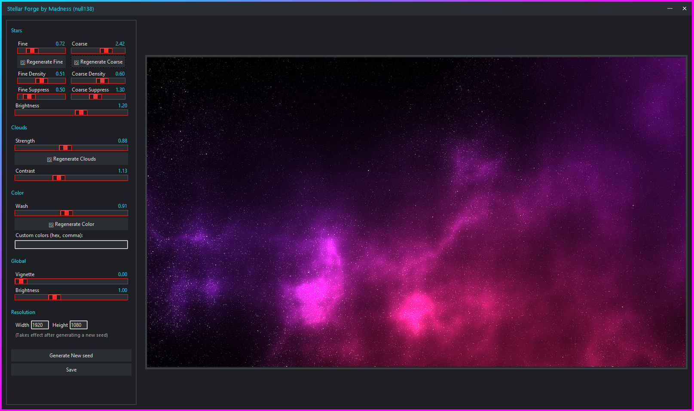

**[RU]** [Перейти к описанию на русском | Jump to RU](https://github.com/null138/stellar-forge?tab=readme-ov-file#ru)

# [EN]
***Author***: **Madness (null138)** | [Steam Profile](http://steamcommunity.com/profiles/76561198098349799) | [Discord Server](https://discord.gg/SHW82GMrV4)

# stellar-forge
Stellar Forge lets you instantly generate and customize beautiful space-themed visuals, from vibrant nebula to deep cosmic color blends, and export them as PNG images for use as backgrounds, artwork, or game assets (for example, skyboxes). You can also turn the final image into a skybox using this tool: https://github.com/null138/se-skybox-generator

# Features
- Customizable stars, density, brightness, nebula effects, and color schemes, with support for exporting images in all resolutions.
- Seed-based generation for every part of the image. Every result is random.
- Fully adjustable parameters, allowing each setting to be modified separately and applied instantly to the preview.

# Usage
- Download the latest release from the [Releases](https://github.com/null138/stellar-forge/releases) section.
- Extract the archive to a folder before running the tool.
- Run the executable.
- Adjust settings as needed, or leave them as they are and click “Generate New Seed”.
- To change star positions, click the “Regenerate Stars” button, or to change clouds, click the “Regenerate Clouds” button. The same applies to colors.
- If you don’t want random colors, you can enter your desired colors in the custom colors input as hex values, in order. For example: `FF0000` for red only, or `FF0000,000DFF`, etc. Each value represents a color used in generation.
- When you are happy with the result, click the “Save” button and choose where to save the image.

# Important
- To apply a new resolution, change the resolution and click “Generate New Seed”. Otherwise, the change will not be applied. After that, you don’t need to click “Generate New Seed” again — you can simply change settings and they will be applied automatically for that resolution.
- This is a beta version, so there may be bugs that were not discovered during testing. 
- It may also feel slow on lower-performance devices. Everything except the cloud is generated on the CPU. The cloud rendering is done on the GPU (Perlin noise is very slow otherwise)

#

# [RU]
***Автор***: **Madness (null138)** | [Профиль Steam](http://steamcommunity.com/profiles/76561198098349799) | [Discord сервер](https://discord.gg/SHW82GMrV4)

# stellar-forge
Stellar Forge позволяет мгновенно создавать и настраивать красивые космические визуалы — от ярких туманностей до глубоких космических цветовых переходов — и экспортировать их в PNG-изображения для использования в качестве обоев, арта или игровых ассетов (например, skybox'ов). Также вы можете превратить финальное изображение в skybox с помощью этого инструмента: https://github.com/null138/se-skybox-generator

# Возможности
- Настраиваемые звёзды, плотность, яркость, эффекты туманностей и цветовые схемы с поддержкой экспорта изображений в любых разрешениях.
- Генерация на основе seed для каждой части изображения. Каждый результат случайный.
- Полностью регулируемые параметры, позволяющие менять каждую настройку отдельно и мгновенно применять её в предпросмотре.

# Использование
- Скачайте последнюю версию из раздела [Releases](https://github.com/null138/stellar-forge/releases).
- Распакуйте архив в папку перед запуском инструмента.
- Запустите исполняемый файл.
- Настройте параметры по необходимости или оставьте их по умолчанию и нажмите “Generate New Seed”.
- Чтобы изменить расположение звёзд, нажмите “Regenerate Stars”, для изменения облаков — “Regenerate Clouds”. То же самое относится к цветам.
- Если вы не хотите случайные цвета, можно ввести свои значения в формате hex в поле пользовательских цветов, в порядке использования. Например: `FF0000` (только красный) или `FF0000,000DFF` и т.д. Каждое значение — это цвет генерации.
- Когда результат вас устраивает, нажмите “Save” и выберите место сохранения изображения.

# Важно
- Чтобы применить новое разрешение, измените его и нажмите “Generate New Seed”. Иначе изменение не применится. После этого повторно нажимать “Generate New Seed” не нужно — можно просто менять настройки, и они будут применяться автоматически для выбранного разрешения.
- Это бета-версия, поэтому возможны ошибки, не выявленные во время тестирования.
- На слабых устройствах может работать медленно. Всё, кроме облаков, генерируется на CPU. Рендер облаков выполняется на GPU (Perlin noise слишком медленный на CPU).
